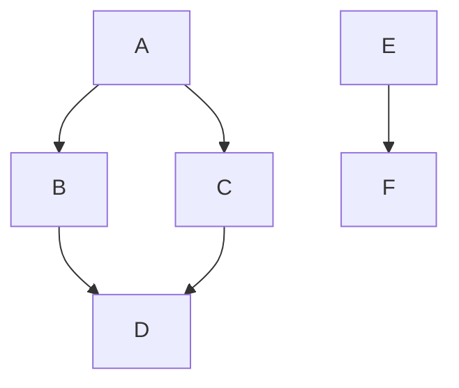

# Markdown Confluence Sync action

This action syncs markdown files to Confluence using the [Markdown Confluence Sync](https://github.com/Telefonica/cross-confluence-tools/tree/main/components/markdown-confluence-sync) library.

## Table of contents

- [Features](#features)
- [Usage](#usage)
  - [Markdown files to sync](#markdown-files-to-sync)
  - [Tree operation mode](#tree-operation-mode)
  - [Flat operation mode](#flat-operation-mode)
  - [Id operation mode](#id-operation-mode)
- [Configuration](#configuration)
  - [Inputs](#inputs)
  - [Configuration file](#configuration-file)
  - [Environment variables](#environment-variables)
- [Contributing](#contributing)
- [License](#license)




## Features

* It creates/updates/deletes [Confluence](https://www.atlassian.com/es/software/confluence) pages based on markdown files in a directory.
* Upload images to Confluence and update links in markdown files
* Supports Mermaid diagrams
* Per-page configuration using [frontmatter metadata](https://jekyllrb.com/docs/front-matter/)
* Works great with [Docusaurus](https://docusaurus.io/)
* Three modes of operation:
  * **tree**: Mirrors the hierarchical pages structure from given folder under a Confluence root page
  * **id**: Synchronize a list of markdown files matched by a [glob pattern](https://github.com/isaacs/node-glob#glob-primer) directly to specific Confluence pages using the Confluence id provided in the frontmatter metadata or in the configuration file.
  * **flat**: Synchronize a list of markdown files matched by a [glob pattern](https://github.com/isaacs/node-glob#glob-primer) as children page of a Confluence root page, without any hierarchy. It is also possible to provide a Confluence id to some pages to update them directly, as in the id mode.
  
> [!NOTE]
> Read the [Markdown Confluence Sync library documentation](https://github.com/Telefonica/cross-confluence-tools/tree/main/components/markdown-confluence-sync) for detailed information about all features and configuration options.

## Usage

### Markdown files to sync

All the markdown files to be synced must have frontmatter properties "title" and "sync_to_confluence" set to true (unless you are using the `files-metadata` option). For example:

```markdown
---
title: My page title
sync_to_confluence: true
---

# My page content
```

### Tree operation mode

You should use __tree__ mode in case your markdown files are organized in a hierarchical structure and you want to mirror this structure in Confluence. For example:

```text
docs/
├── getting-started.md
└── user-guide/
    ├── index.md
    ├── installation.md
    └── configuration.md
```

```yaml
- name: Sync markdown files to Confluence
  uses: Telefonica/markdown-confluence-sync-action@v1
  with:
    mode: tree
    docs-dir: './docs'
    confluence-url: 'https://your.confluence.es'
    confluence-root-page-id: '123456789'
    confluence-space-key: 'YOUR-SPACE-KEY'
    confluence-personal-access-token: ${{ secrets.CONFLUENCE_PAT }}
```

> [!TIP]
> Read the [tree mode docs](https://github.com/Telefonica/cross-confluence-tools/tree/main/components/markdown-confluence-sync#tree-mode) for further information about configuration options and how to organize your markdown files.

### Id operation mode

If you want to update only specific pages directly by providing their id, you can use the id mode. In this mode, you don't need to provide a root page id. Each page in the list must have an id, and the library will update the corresponding Confluence page having the id provided. Note that the pages to update must exist in Confluence before running the sync process.

This mode is very useful when you want to update only a few pages, such as the README.md or the CHANGELOG.md files.

> [!TIP]
> Use the `files-metadata` option to provide the data of the files to sync without having to modify the markdown files themselves.

For example:

```yaml
- name: Sync markdown files to Confluence
  uses: Telefonica/markdown-confluence-sync-action@v1
  with:
    mode: id
    docs-dir: '.'
    files-pattern: '*.md'
    files-metadata: |
      [
        {
          "path": "README.md",
          "id": "123456789",
          "title": "My project README",
          "sync": true
        },
        {
          "path": "CHANGELOG.md",
          "id": "987654321",
          "title": "My project CHANGELOG",
          "sync": true
        }
      ]
    confluence-url: 'https://your.confluence.es'
    confluence-space-key: 'YOUR-SPACE-KEY'
    confluence-personal-access-token: ${{ secrets.CONFLUENCE_PAT }}
```

### Flat operation mode

You should use __flat__ mode in case your markdown files are not organized in a hierarchical structure and you want to synchronize all of them as children of a Confluence root page.

As an extra in this mode, a Confluence id can be provided to some pages, as in the "id mode", to update them directly.

For example:

```markdown
---
title: My page title
sync_to_confluence: true
confluence_page_id: 123456789
---
```

```yaml
- name: Sync markdown files to Confluence
  uses: Telefonica/markdown-confluence-sync-action@v1
  with:
    mode: flat
    docs-dir: './docs'
    confluence-url: 'https://your.confluence.es'
    confluence-root-page-id: '123456789'
    confluence-space-key: 'YOUR-SPACE-KEY'
    confluence-personal-access-token: ${{ secrets.CONFLUENCE_PAT }}
```

## Configuration

The action accepts a configuration file in the root of the repository, and it can be also configured using Github action inputs or even environment variables.

> [!TIP]
> You can also use a combination of all methods. In such case, the action inputs will override the configuration file values and the environment variables.

### Inputs

> [!WARNING]
> Inputs appearing here as required are required by the action, but they can be provided in the configuration file or environment variables, not necessarily in the action inputs.


| Name | Description | Required | Default |
|------|-------------|----------|---------|
| `mode` | Operation mode: `tree`, `id` or `flat` | No | `tree` |
| `docs-dir` | Path to the directory containing the markdown files | __Yes__ | |
| `files-metadata` | Array of objects with the metadata of the files to sync, expressed as an stringified JSON (supports multiline). Each object must have at least the `path` property for identifying the file. For the rest of properties read the [markdown-confluence-sync docs](https://github.com/Telefonica/cross-confluence-tools/tree/main/components/markdown-confluence-sync#filesmetadata-property) | No | |
| `files-pattern` | Pattern to filter the files to sync in flat or id mode | No | |
| `confluence-url` | Confluence base URL | __Yes__ | |
| `confluence-root-page-id` | ID of the Confluence page under which the pages will be synchronized | __Yes__ | |
| `confluence-space-key` | Key of the Confluence space where the pages will be synced | __Yes__ | |
| `confluence-personal-access-token` | Confluence personal access token | __Yes__ | |
| `confluence-root-page-name` | Customize Confluence page titles by adding a prefix to all of them for improved organization and clarity | No | |
| `confluence-notice-message` | Notice message to add at the beginning of the Confluence pages | No | `<p><strong>AUTOMATION NOTICE: This page is synced automatically, changes made manually will be lost</strong></p>` |
| `confluence-notice-template` | Template string to use for the notice message | No | |
| `confluence-dry-run` | Dry run mode: Do not update Confluence pages. Only log pages to sync | No | `false `|
| `log-level` | Log level: `silent`, `silly`, `debug`, `verbose`, `info`, `warn`, `error` | No | `info` |
| `cwd` | Current working directory. Path from where resolve `docs-dir`, `files-pattern`, and search for the configuration file | No | `.` |

> [!NOTE]
> Some markdown-confluence-sync options are not available as inputs in the action, as `preprocessor`. If you need to use them, you can set them in the [configuration file](#configuration-file) or using [environment variables](#environment-variables). Refer to the [Markdown Confluence Sync library docs](https://github.com/Telefonica/cross-confluence-tools/tree/main/components/markdown-confluence-sync#configuration-file) for further info about all available options.

### Configuration file

It supports many patterns for naming the file, as well as file formats.

Just take into account that the namespace for the configuration is `markdown-confluence-sync`, so, possible configuration files may be:

* `markdown-confluence-sync.config.js`.
* `.markdown-confluence-syncrc.yaml`.
* `.markdown-confluence-syncrc.json`.

```js title="markdown-confluence-sync.config.js"
module.exports = {
  docsDir: "docs",
  confluence: {
    url: "https://my-confluence.es",
    personalAccessToken: "*******",
    spaceKey: "MY-SPACE",
    rootPageId: "my-root-page-id"
  }
}
```

> [!NOTE]
> Read the [Markdown Confluence Sync library docs](https://github.com/Telefonica/cross-confluence-tools/tree/main/components/markdown-confluence-sync#configuration-file) for further info about the configuration file.

### Environment variables

The action can be configured using environment variables. The environment variables must be prefixed with `MARKDOWN_CONFLUENCE_SYNC_` and use uppercase letters.

Read the [Markdown Confluence Sync library docs](https://github.com/Telefonica/cross-confluence-tools/tree/main/components/markdown-confluence-sync#environment-variables) for further info about environment variables.

## Contributing

Please read our [Contributing Guidelines](./.github/CONTRIBUTING.md) for details on how to contribute to this project before submitting a pull request.

## License

This project is licensed under the Apache-2.0 License - see the [LICENSE](./LICENSE) file for details.
